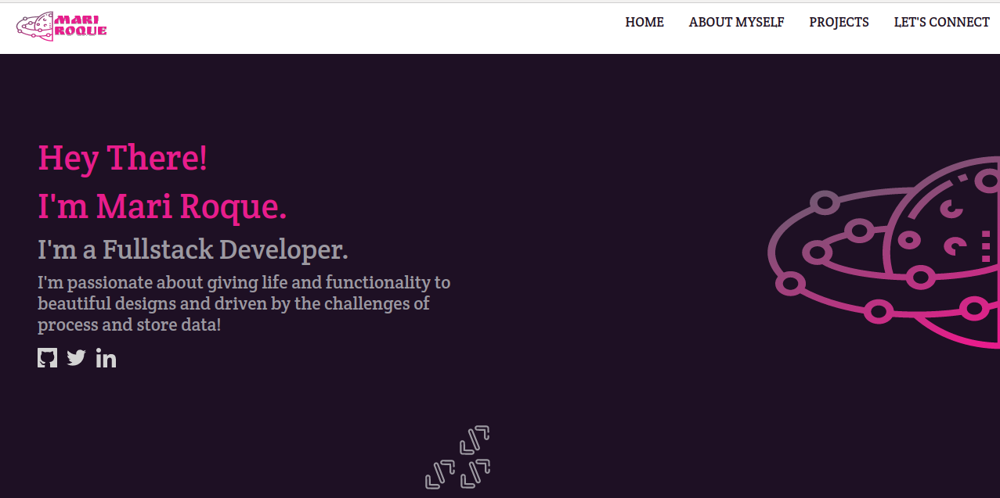

# Mari Roque - Personal Potfolio

> This is a responsive website to present myself and showcase my best projects. Developed using HTML5, CSS3 and Bootstrap.

# A Live Version is available soon [HERE](https://mariroqueproject.com)

## Built With

- HTML5
- CSS3
- Bootstrap

## Author

👤 **Marilena Roque**

- Github: [MarilenaRoque](https://github.com/MarilenaRoque)
- Twitter: [@MariRoq88285995](https://twitter.com/MariRoq88285995)
- Linkedin: [roquemarilena](https://www.linkedin.com/in/roquemarilena/)

## 🤝 Contributing

Contributions, issues and feature requests are welcome!

Feel free to check the [issues page](issues/).

## Show your support

Give a ⭐️ if you like this project!

## Icons
From [FlatIcon](https://www.flaticon.com/)
Made by [Pixel perfect](https://www.flaticon.com/br/autores/pixel-perfect)
Made by [Freepik](https://www.flaticon.com/br/autores/freepik)
Made by [Catkuro](https://www.flaticon.com/br/autores/catkuro)
Made by [Eucalyp](https://www.flaticon.com/br/autores/eucalyp)

